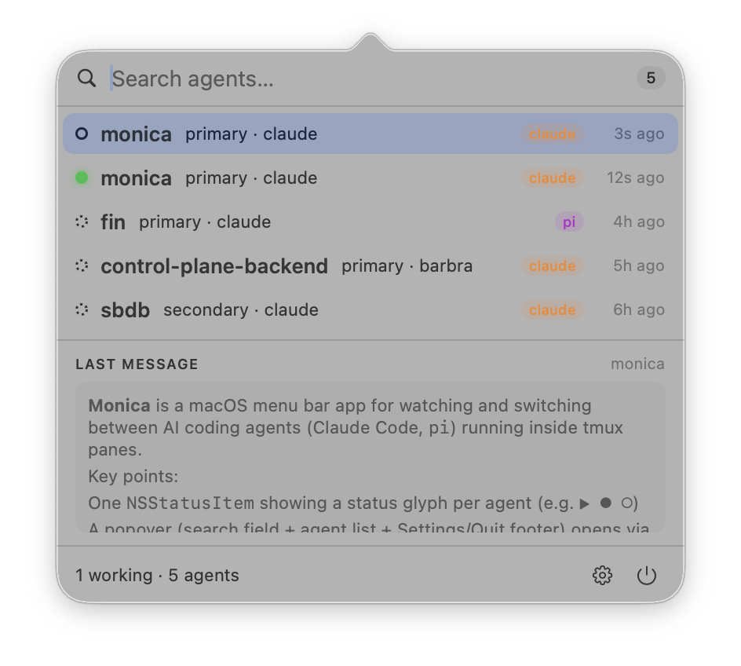

# Monica

A macOS menu bar app for watching and switching between AI coding agents (Claude
Code, `pi`) running inside tmux panes.



## What it does

Monica sits in your menu bar as a status item showing one glyph per agent, reflecting
whether each is idle, working, or waiting on you:


Click the icon, or press a global hotkey, to open a popover with:

- a searchable list of all agents across your tmux sessions, with status and
  last-updated time
- a preview of each agent's last message
- Return to switch tmux to that agent's pane
- ⌘Return to compose a message and send it into the pane without switching

## Requirements

- macOS 14+
- tmux, with Claude Code and/or `pi` running in tmux panes
- The status data comes from Claude Code hooks / the `pi` tmux-status extension;
  Monica only reads it, it never writes to `~/.local/share/aistatus/`. See
  [docs.md](docs.md) for how to set these up.

## Build & run

No Xcode project — this uses SwiftPM directly.

```bash
nix develop   # devshell
make run      # swift run — build + launch
make build    # debug build
make app      # release build wrapped as monica.app (LSUIElement, no dock icon)
make link     # symlink monica.app into /Applications
```

## More

See `AGENTS.md` for build/test details and a list of non-obvious gotchas, and
`DESIGN.md` for the full architecture and design decisions.
